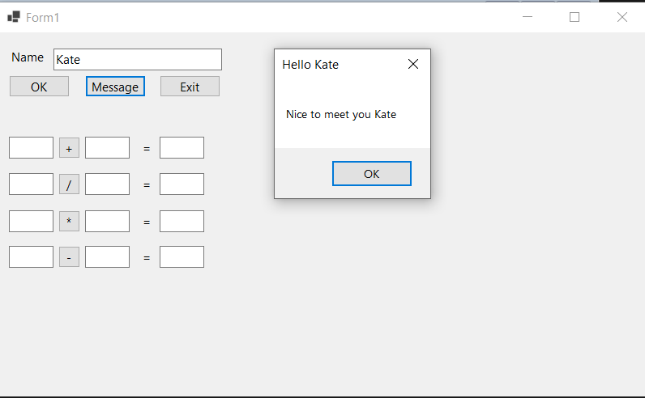
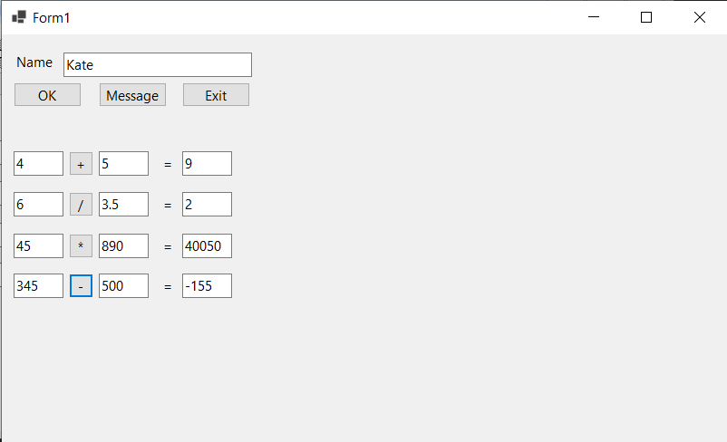

# VisualBasicPractice1
In this repo I practice creating a form using Windows Forms App (.NET Framework)/ Visual Basic.
## The form does the following:
* Input a name and receive a message with your name
* Exit out of form
* Input two values to add, divide, multiply and subtract them and get a result ( values can be decimal but the result will be rounded )
* 
* 
